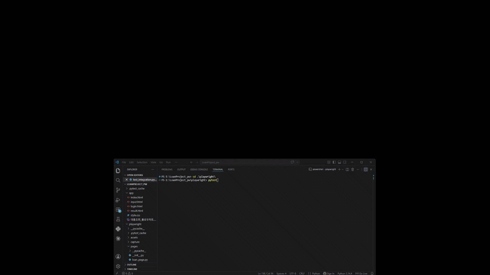
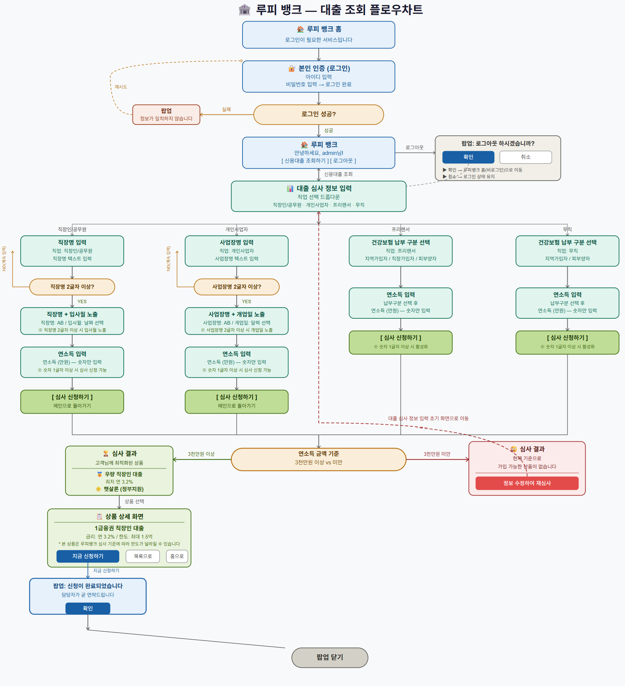

# 신용대출 조회 자동화 테스트 프로젝트 (Playwright)

Playwright와 Pytest를 활용하여 직접 제작한 웹 대출 서비스의 주요 시나리오를 자동화 테스트한 프로젝트입니다.

반복적으로 수행되는 대출 심사 흐름을 자동화하면서,
단순 기능 확인뿐 아니라 실제 QA 업무에서 경험했던 예외 상황과 FAIL 케이스를 테스트 시나리오에 반영해보는 데 목적을 두었습니다.

## 테스트 시연 (Demo)
<!-- 실행 GIF 캡처 후 추가 권장 -->


---

## 1. 프로젝트 소개

로그인부터 대출 심사 결과 확인까지의 흐름을 가진 간단한 금융 웹앱을 직접 제작하고 테스트 대상으로 사용했습니다. 직업 유형에 따라 입력 필드와 질문 흐름이 달라지도록 구성했으며, 특정 조건에서는 일부 질문이 노출되지 않아야 하는 예외 흐름도 포함했습니다.

### 테스트 대상 주요 기능
- **직업 유형 4종**: 직장인/공무원, 개인사업자, 프리랜서, 무직
- **연소득 기준 심사**: 3,000만원 이상 승인 / 미만 거절
- **유효성 검사**: 직장명·사업장명 2글자 이상, 연소득 1글자 이상 입력 시 신청 활성화
- **팝업 처리**: 로그인 실패, 로그아웃 확인, 신청 완료 팝업

---

## 2. 테스트 시나리오 구성

QA 관점에서 가장 중요하게 봤던 부분은 “조건에 따라 보여야 할 화면과 보여선 안 되는 화면이 정확히 제어되는가”였습니다.  
특히 프리랜서와 무직 유형에서는 직장명이나 사업장명 입력 단계가 노출되지 않아야 했기 때문에, 해당 질문이 실제로 스킵되는지에 신경을 썼습니다.  
이전 업무에서도 특정 조건에서 불필요한 입력 필드가 노출되는 이슈를 직접 확인하고 리포팅했던 경험이 있었기 때문에, 이번 테스트 케이스 설계에서도 비슷한 예외 상황을 고려해 시나리오를 구성했습니다.

## 대출 조회 플로우 차트



---

## 3. 프로젝트 구조
```
LoanProject-Playwright/
├── app/                        # [Target] 테스트 대상 웹앱
├── pages/                      # [POM] 페이지별 Selector & Action
├── tests/                      # [Scenario] 테스트 시나리오
├── capture/                    # [Debug] 실패 시 자동 스크린샷
├── images/                     # [Doc] GIF 파일
├── conftest.py
├── pytest.ini
├── requirements.txt
└── .gitignore
```
---

## 4. 테스트 케이스 및 결과

> 일부 케이스(TC_03, TC_06)는 의도적으로 잘못된 기대값을 입력하여
> 자동화 테스트가 FAIL 상황을 정상적으로 감지하는지 확인하기 위한 케이스입니다.

> 자동화 테스트를 학습하면서
> “모든 테스트가 PASS만 되는 것이 정말 테스트일까?”라는 고민이 있었고,
> 실제 실패 상황에서도 스크립트가 제대로 동작하는지 확인해보고 싶었습니다.

| Case ID | 직업 유형 | 기대 결과 | 실행 결과 | 비고 |
| :--- | :--- | :--- | :--- | :--- |
| **TC_01** | 직장인 / 공무원 | 거절 | PASS | |
| **TC_02** | 직장인 / 공무원 | 승인 | PASS | |
| **TC_03** | 개인사업자 | 거절 | FAIL | 의도적 결함 주입 케이스 |
| **TC_04** | 개인사업자 | 승인 | PASS | |
| **TC_05** | 프리랜서 | 거절 | PASS | |
| **TC_06** | 프리랜서 | 승인 | FAIL | 의도적 결함 주입 케이스 |
| **TC_07** | 무직 | 거절 | PASS | |
| **TC_08** | 무직 | 승인 | PASS | |

---

## 5. 자동화하면서 고민했던 부분

### 반복 테스트를 줄이기 위한 구조 변경 (v1 -> v2)
초기(v1)에는 직업 유형별로 테스트 함수를 각각 작성했습니다. 
처음에는 테스트 흐름을 이해하는 데 도움이 되었지만, 직업 유형만 다르고 대부분의 동작이 비슷하다 보니 코드가 반복적으로 길어졌고, 시나리오가 변경된다면 여러 테스트를 직접 수정해야 하는 불편함이 있을것으로 예상되었습니다.

이후 parametrize를 활용하여 공통 흐름은 하나의 함수로 구성하고, 데이터만 변경하는 방식으로 수정했습니다.
이를 통해 반복 코드 감소, 테스트 흐름 가독성이 확보 될 수 있었습니다.
또한 추후 시나리오 변경 시 수정 범위를 최소화 할 수있다는 것을 알 수있게 되었습니다.

### 실패 상황 확인을 위한 스크린샷 저장
테스트 실패 시 capture/ 폴더에 자동으로 스크린샷이 저장되도록 구성했습니다. 

이전 업무에서 이슈 리포팅 시 “어떤 화면에서 어떤 문제가 발생했는지”를 최대한 상세하게 전달하려고 노력했기 때문에, 자동화 테스트에서도 실패 상황을 바로 시각적으로 확인할 수 있도록 기능을 추가했습니다.  
실제 학습 과정에서 디버깅 자체에 큰 도움을 받은 것은 아니었지만, 개발자가 상황을 빠르게 확인하고 수정에 집중할 수 있는 협업 형태를 자동화로 구현해보고 싶었습니다.

### Playwright의 Auto-Wait 경험
이전 Appium 기반 자동화를 학습할 때는 타이밍 이슈로 인해 테스트가 불안정하게 실패하는 Flaky Test를 경험했습니다. 반면 Playwright는 Auto-Wait 기능이 기본 적용되어 있어 별도의 wait 처리를 많이 추가하지 않아도 비교적 안정적으로 테스트가 동작했습니다.
반복 실행 시 플레이키 현상이 줄어드는 것을 경험하면서, 자동화 테스트에서 안정성이 얼마나 중요한지도 다시 느낄 수 있었습니다.

---

## 6. 사전 준비 (Prerequisites)

- **Python 3.14**
- **Playwright** (Chromium)

---

## 7. 설치 및 실행

```bash
# 저장소 클론
git clone https://github.com/kimhy32500/LoanProject-Playwright.git

# 라이브러리 설치
pip install -r requirements.txt
playwright install
```

### pytest 기반 실행 (권장)

```bash
# 기본 실행
pytest tests/test_integration.py

# 상세 에러 로그 출력
pytest --tb=short
```
